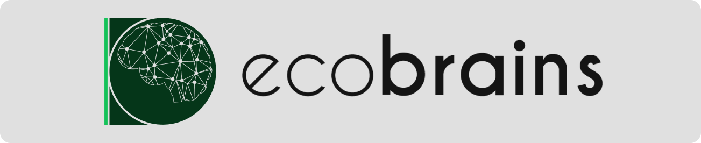
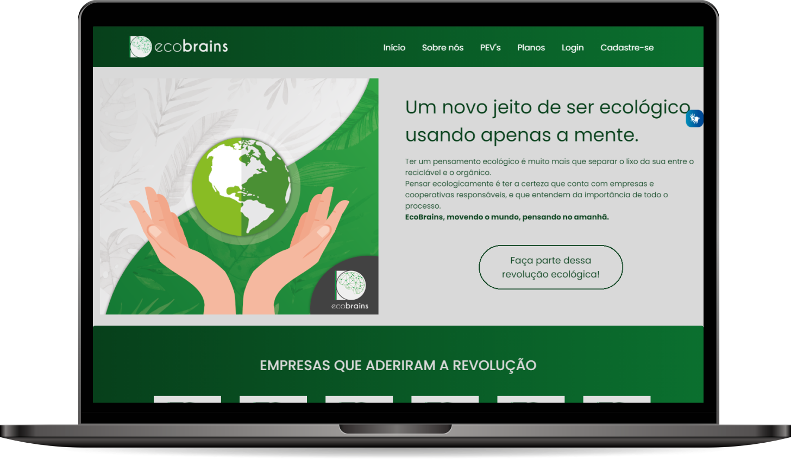
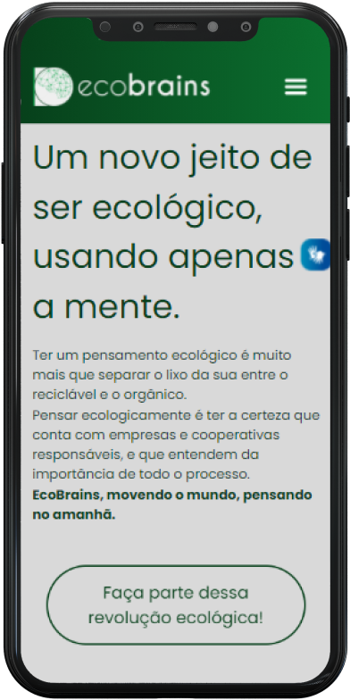

<h1 align="center">
  
</h1>

<p align="center">
  <a href="#-tecnologias">Tecnologias</a>&nbsp;&nbsp;&nbsp;|&nbsp;&nbsp;&nbsp;
  <a href="#-projeto">Projeto</a>&nbsp;&nbsp;&nbsp;|&nbsp;&nbsp;&nbsp;
  <a href="#-requisitos-do-servidor">Requisitos do servidor</a>&nbsp;&nbsp;&nbsp;|&nbsp;&nbsp;&nbsp;
  <a href="#-setup">Setup</a>&nbsp;&nbsp;&nbsp;|&nbsp;&nbsp;&nbsp;
  <a href="#memo-licença">Licença</a>
</p>

<p align="center">
  <a href="https://github.com/onlybrains/WebSite-EcoBrains/commits/master">
    
  </a>

  <a href="https://github.com/cleysonsilvame/disk-pizza/issues">
    
  </a>

  
</p>

<p align="center">
  
    
</p>

## 🚀 Tecnologias

Esse projeto foi desenvolvido com as seguintes tecnologias:

- PHP
- CodeIgniter 4
- MariaDB
- HTML
- CSS
- Bootstrap
- JavaScript

## 💻 Projeto

Por meio de nossas pesquisas e entrevistas com funcionários ativos nas áreas que serão atingidas por essa aplicação, concluímos que podemos facilitar o contato entre empresas e cooperativas que atualmente ainda é muito burocrático e difícil.

Conseguimos entender que a maioria das empresas tanto quanto das cooperativas tem acesso a internet o que automaticamente facilita o acesso para aplicações web. Pensando nessa facilidade tivemos a ideia de desenvolver uma aplicação web utilizando as tecnologias mais recentes e as normas e instruções relacionadas a experiência e interface para o usuário.

Pretendemos com essa aplicação interligar a comunicação e as necessidades propostas por esses dois grupos, além de facilitar e agilizar o contato e a negociação entre estes ♻️.

## ⚙️ Requisitos do servidor

- PHP 7.2
- intl
- libcurl
- mbstring
- mysqlnd
- mysqli

## 🔧 Setup

```
 - Copy `env` to `.env` and tailor for your app, specifically the baseURL
  and any database settings.
```

## :memo: Licença

Esse projeto está sob a licença MIT. Veja o arquivo [LICENSE](LICENSE) para mais detalhes.

### 🙋‍♂️ Autores

---

<table border="0">
<tr>
<td>
  <div style="margin-right: 20px">
  <a href="https://github.com/cleysonsilvame/" title="Cleyson Silva">
  
  <br />

<sub><b>Cleyson Silva</b></sub> 🚀
</a>

  </div>
</td>
<td>
  <div style="margin-right: 20px">
  <a href="https://github.com/LuigiRamires" title="Luigi de Oliveira">
  
  <br />

<sub><b>Luigi de Oliveira</b></sub> 🚀</a>

  </div>
</td>

<td>
  <div style="margin-right: 20px">
  <a href="https://github.com/franciscone" title="Matheus Franciscone">
  
  <br />

<sub><b>Matheus Franciscone</b></sub> 🚀</a>

  </div>
</td>
</tr>
</table>

👋🏽 Entre em contato!

[](mailto:grouponlybrains@gmail.com)
